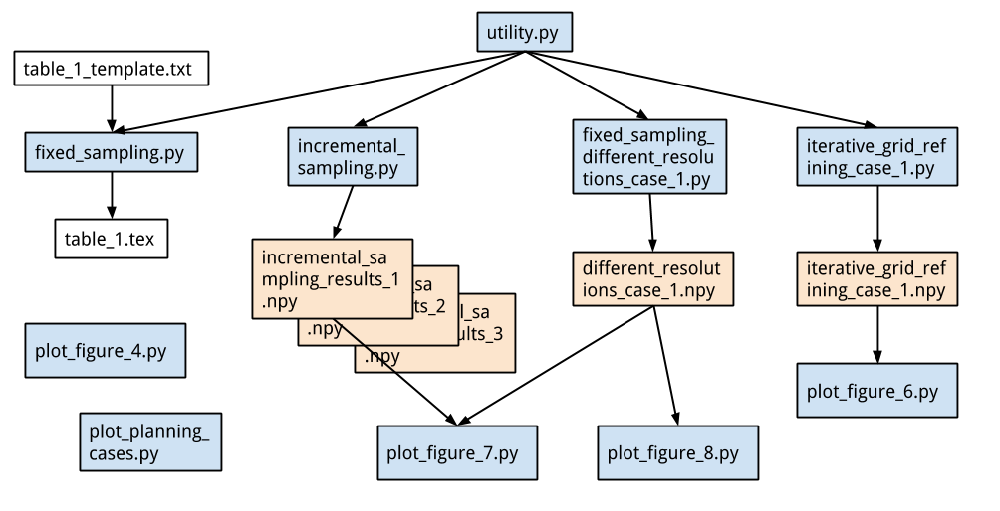

# Sampling-based Tube Following for Redundant Robotic Manipulators
This repository contains python scripts to recreate the simulation results and figures of the research paper `Sampling-based Tube Following for Redundant Robotic Manipulators`.

## Requirements to run scripts

### Python 3.6
The scripts are testen using Python 3.6. The easiest way to get all the required libraries is installing the [Anaconda distribution](https://www.anaconda.com/download) for Python 3. The only non-standard libraries, appart from `ppr` discussed below, are [NumPy](http://www.numpy.org/) and [Matplotlib](https://matplotlib.org/) which are included in Anaconda.

### Planar Python Robotics (ppr)
The path planning algorithms are written in a custom made software framework for planar robotics. I added the package in this repository to avoid installation issues. I tested it on Ubuntu 16.04. It's not working on Windows 10 for the moment, but I'm working on it. The version included here is the one used when writing the research paper. To use the latest version, checkout the [last section](#using-the-latest-version-of-ppr) on this page.

## Running the scripts

The scripts starting with `plot_` are for, you guessed it, plotting stuff. The default figures are already in the folder `figure/`. Other scripts run simulations and save the data in the folder `data`. A special case is the script `fixed_sampling.py`, which used the table template to generate `table_1.tex`. I made a figure showing how scripts and data files are related.


## Using the latest version of ppr

I have not managed to get it working on Windows or MacOS. However, I have a much greater appreciation for cross platorm software after trying to get this working on other platforms. But for linux (tested on Ubuntu 16.04) you can do the following.

### Version 0.2.1 or newer
I've put the package on [PyPi](https://pypi.org/project/ppr/) wich should work on linux, given that you install swig to build the package. (The PyPi version started working from version 0.2.1.)

```bash
sudo apt install swig
pip install ppr
```

Or download / clone the git repo and then, in this directory you can do:

```bash
sudo apt install swig
python setup.py build
python setup.py install
```

### Version 0.1.2 or older

1) Download the repository [here](https://gitlab.mech.kuleuven.be/u0100037/planar_python_robotics/tags). For the results in the paper I used version `0.1.2`.
2) Unzip the file somewhere you can remember. You need the path later on!

(The gilab download icon, located on the right of the version description, looks like this:
)

In order the use the `ppr` package, you need to add the location to the path. An easy way to do this is adding the following lines to the python script using the package:

```python
from sys import path
path.append(r"/home/jeroen/Documents/gitlab/planar_python_robotics")
```

Here you change the string `/home/jeroen/Documents/gitlab/planar_python_robotics` to where you put the unzipped folder.
